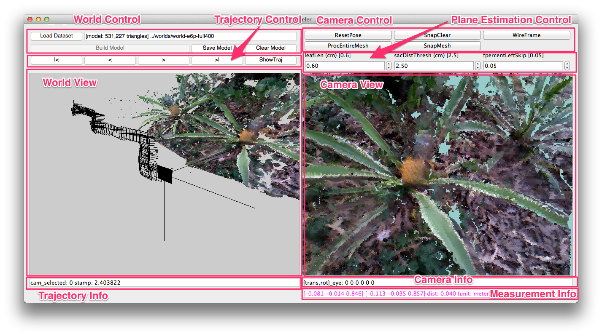

# pyFastfusion
A Python wrapper/interface for the fastfusion algorithm

* For how to build/install/play, please refer to [this manual page](https://y-j-n.github.io/pyFastfusion/).
* [fastfusion](https://github.com/tum-vision/fastfusion) is a volumetric 3D reconstruction algorithm by the [TUM Computer Vision Group](https://github.com/tum-vision)

